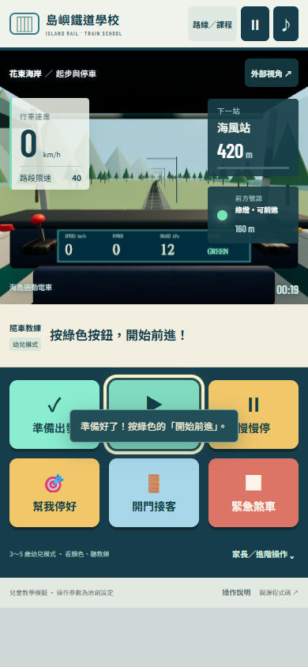

# 島嶼鐵道學校

讓 3～5 歲孩子在手機上試著開火車。先按大綠色按鈕準備出發，再前進、煞車、停靠車站、開門接客。中文語音教練會提醒下一個動作，家長可以展開完整駕駛台，陪孩子認識列車慣性、牽引力、空氣煞車與號誌。

此專案是 MIT 開源的 Three.js／Vite 3D 遊戲，車輛與駕駛艙由 Blender 建模，使用真正的 PNG 材質 atlas 經 UV 貼在模型上，並將圖片內嵌於 GLB。離線需要的程式、字型、模型與貼圖皆由網站自身提供，沒有帳號、付費門檻或遠端資料蒐集。

公開位置由發布流程部署：

- 網站：[島嶼鐵道學校](https://mars-tw.github.io/taiwan-train-school/)
- 原始碼：[mars-tw/taiwan-train-school](https://github.com/mars-tw/taiwan-train-school)

上面是專案的公開目標位置；實際部署狀態請看 GitHub Actions。手機可用 Safari 或 Chrome 開啟網站，加入主畫面；首次完整載入後，PWA 會快取模型及圖片，再次使用可離線開啟。



## 孩子怎麼玩

1. 按「準備出發」，教練協助依序開主電源、關門、選前進方向、釋放煞車。
2. 按「開始前進」，以低段動力起步。火車會慢慢加速。
3. 看見車站或紅燈，按「慢慢停」。火車有慣性，煞車需要建立氣壓，不會立刻停住。
4. 想練習到站時按「幫我停好」。教練透過實際動力、煞車與低速微調協助停車，不跳過路程或移動列車位置。
5. 停穩後按「開門接客」，等乘客上車，再按「關門出發」。

預設六個主要按鈕有顏色、圖示與文字，觸控高度至少 64 px。教練會用外框標示下一個按鈕。第一次操作後啟用瀏覽器的 `speechSynthesis` 中文語音；右上角音符可以靜音。裝置沒有可用中文語音或不支援語音時，畫面仍會完整顯示大字提示。

家長可以按「家長／進階操作」展開獨立動力和煞車手柄、主電源、車門、方向選擇，以及即時煞車缸壓和牽引力。設定頁可以關閉幼兒模式，改成完整手動操作。輔助模式會提示停車距離，超速過多時協助減速；進階模式保留全部物理與互鎖，讓玩家自行控制。

## 路線與課程

三條風景路線為台灣景觀啟發的原創練習路線：花東海岸、台北城市、阿里山森林。地形曲率、坡度、景物與站名各有差異，不是實際鐵路的路線圖。兩種列車共用原創車體，但有不同質量、牽引曲線與煞車參數：海島通勤電車、山海區間列車。

| 課程 | 練習內容 | 停靠 |
| --- | --- | --- |
| 01 起步與停車 | 行車準備、低段動力、提早煞車、上下客 | 一站 |
| 02 精準停靠 | 慣性與空氣煞車延遲、連續接客 | 兩站 |
| 03 號誌與限速 | 紅燈前等候、30 km/h 限速區、重新起步 | 兩站 |

紅燈前 70 公尺內停穩並等 4 秒後，前方列車離開，號誌轉綠。幼兒模式會等待玩家重新按前進。越過紅燈會切除牽引並施加緊急煞車；停穩等待號誌轉綠，解除保護後可繼續，不必重開遊戲。

每站停車區為標記前後 12 公尺，速度必須低於 0.15 m/s；保持至少第 3 段煞車才能開門。上下客要等 4 秒，關門才完成該站。最後一站會顯示完成分數、每站誤差及重玩／下一課按鈕。課程隨時可以暫停、重置。

## 擬真模型

物理採用 SI 單位，在固定 60 Hz 時間步進運行。速度以 km/h 顯示。模型包含質量與慣性、低速牽引力／高速功率上限、簡化 Davis 行車阻力、坡度力、輪軌黏著力上限、牽引建立延遲、加速度變化限制、空氣制動建立延遲、煞車缸壓的指數建立／釋放，以及緊急制動。釋放動力後列車仍會滑行。

所有列車數值都是可調整的原創教育參數，煞車缸壓的 kPa 顯示是遊戲內的模擬值。課程用三色號誌教學，沒有重建台鐵某型車的完整設備或規章。這裡學習的重點是準備順序、停車要提早、門與動力互鎖、看號誌和遵守限速；真實列車另有更多程序與資格要求。

教學設計參考鐵路營運單位的公開資料：[Network Rail 號誌說明](https://www.networkrail.co.uk/stories/signals-explained/)、[Network Rail 軌道電路](https://www.networkrail.co.uk/stories/track-circuits-explained/)、[RSSB 輪軌黏著研究](https://www.rssb.co.uk/research/flagship-research-activities/adhesion/)。原始碼沒有複製這些單位的圖片或實車操作數值。

## 本機開發與手機測試

需要 Node.js 24 或更新的相容版本。

```sh
npm ci
npm run dev
```

瀏覽器開啟 `http://localhost:5180/`。手機和電腦在同一個 Wi-Fi 時，開啟 Vite 顯示的區網網址。正式版：

```sh
npm test
npm run build
npm run serve
```

正式版使用 Node 靜態服務 `5180` 埠，可以用 `TRAIN_SCHOOL_PORT` 覆寫。區網 HTTP 可以玩，PWA 離線與安裝需 HTTPS 或 localhost。

原始碼包可用 PowerShell 建立：

```powershell
pwsh -File scripts/package-source.ps1
```

輸出 `release/train-school-source.zip`，包含程式、MIT 授權、第三方聲明、真正的 `.blend`、貼圖與 GLB、可直接開啟的 build、測試和文件。產包腳本排除 node_modules、私密設定、稽核暫存、其他 zip 及備份檔。

## 結構與驗證

| 檔案 | 用途 |
| --- | --- |
| `src/physics.js` | 可獨立測試的列車動力與空氣煞車 |
| `src/game.js` | 互鎖、紅燈保護、停站、課程與低速停車協助 |
| `src/world.js` | Three.js 世界、Blender 模型、即時 3D 儀表與控制桿 |
| `src/main.js` | 觸控、鍵盤、語音、UI、PWA 註冊 |
| `blender/models.blend` | 可編輯車體及駕駛艙來源 |
| `blender/build_assets.py` | 重新建製、UV 材質、GLB 匯出與渲染 |
| `docs/TEXTURES.md` | 圖片來源、材質製作及授權記錄 |
| `tests/physics.test.js` | 物理、互鎖、保護恢復及所有課程可達性 |

執行 `npm test`。瀏覽器的驗收 API 為 `window.__trainSchool`，提供 `{ game, getState(), getAssets(), world }`；`game.start('lesson1', {route:'coast',vehicle:'commuter'})`、`pause()`、`resume()`、`reset()` 可操作課程。`getState()` 回傳真實速度、位置、控制設定、停站進度、號誌、語音文字所對應的狀態。測試覆蓋全部三路線 × 三課程連續物理駕駛到終點。

## 常見問題

**孩子超過車站怎麼辦？** 停穩後可以選後退，用低段動力回到停車區。「幫我停好」也會用實際低速倒車微調，保留慣性和煞車。

**按前進沒有動？** 可能車門未關、電源未開、方向中立、煞車尚未釋放，或還在緊急保護中。幼兒模式按「準備出發」，先完成準備。

**沒有中文語音？** 語音由手機的瀏覽器與系統提供；請先點一下按鈕，確認右上角未靜音、手機媒體音量已開啟。所有指令都有大字提示，沒有語音也能完成。

**兩種車有不同模型嗎？** 目前兩種設定共用一款原創 Blender 通勤車模型，各有質量、牽引和煞車參數。新增外觀可在 `src/config.js` 與 `world.js` 擴充 GLB 資產選擇。

專案程式與原創模型採 MIT。Three.js 為 MIT；Barlow Condensed 為 SIL Open Font License。詳細內容在 `public/THIRD_PARTY_NOTICES.txt` 與 `docs/TEXTURES.md`。本專案不以遊戲名稱暗示任何鐵路公司背書。
